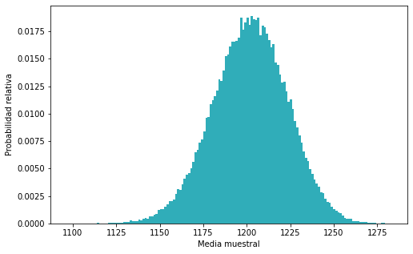
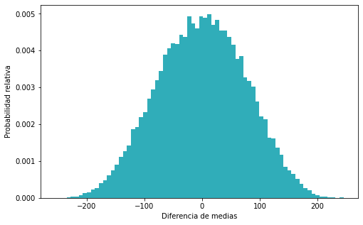

En este tutorial veremos cómo aplicar _bootstrapping_ con reemplazo y _permutations tests_ utilizando Python, para ello utilizaremos varias librerías como `numpy`, `scipy` y `matplotlib.pyplot`.

## Bootstrapping

Bootstrapping es una técnica para probar la hipótesis nula de que la media de un conjunto de datos de longitud $n$ es la misma que la de una población con media conocida, pero con varianza desconocida.

Para llevar a cabo este método se debe de hacer un muestreo aleatorio con reeplazo de tamaño $n$ a los datos múltiples veces. En cada muestreo se almacena la información de la media muestral y posteriormente se construye la distribución de estas medias con la clase `stats.rv_histogram` de `scipy`. Finalmente se utilizará la distribución para calcular el p-valor de la hipótesis nula.

<br>

Para empezar supongamos que se tienen el siguiente conjunto de datos


```python
# Importar numpy
import numpy as np

# Crear un array con los datos
data = np.array([1199, 1270, 1325, 1343, 1250, 1204, 1169, 1125, 1090, 1256, 1183,
        993, 1193, 1348, 1179, 1007, 1197, 1311, 1237, 1161])
```

Investiguemos sobre el número de observaciones y la media muestral


```python
# Imprimir números de datos y la media de los datos
print(f"n: {len(data)}", end="\n"*2)
print(f"Media: {data.mean():.2f}")
```

    n: 20
    
    Media: 1202.00


Son 20 datos con una **media muestral de 1202**. Si la **media poblacional es de 1242**, y se desconoce la varianza poblacional, queremos saber con 95% de confianzan que ambas medias son iguales.

Para probar la hipótesis lo primero que haremos será un muestreo aleatorio con reemplazo de tamaño 20 en los datos, calcularemos y almacenaremos la media muestral y esto lo haremos 100,000 veces. Para ello utilizaremos la función `np.random.choice` la cual realiza muestreos aleatorios. Utilizaremos `replace=True` para que sea con reemplazo 


```python
# Establecer semilla para reproducibilidad
np.random.seed(0)

# Bootstraping con reemplazo
medias_muestrales = [np.random.choice(data, size=20, replace=True).mean() for _ in range(100000)]
```

Procederemos a gráficar el histograma de `medias_muestrales` para visualizar la distribución de la media muestral


```python
# Importar matplotlib
import matplotlib.pyplot as plt

# Establecer tamaño de las gráficas
plt.rc('figure', figsize=(8,5))

# Graficar histograma
values, bins, _ = plt.hist(medias_muestrales, 
                           bins='auto', 
                           color='#30ADB9', 
                           density=True)
plt.xlabel('Media muestral')
plt.ylabel('Probabilidad relativa')
plt.show()
```


    

    


La distribución parace estar sesgada a la izquierda. Por ello en lugar de ajustar una distribución normal a los datos, ajustaremos una distribución genérica con la función `stats.rv_histogram` de `scipy` y procedemos a graficar la distribución.


```python
# Importar stats de scipy
from scipy import stats

# Crear la variable aleatoria
variable_aleatoria = stats.rv_histogram((values, bins))

# Graficar
plt.plot(bins, variable_aleatoria.pdf(bins), color='#BA6A30')
plt.hist(medias_muestrales, 
         bins='auto', 
         color='#30ADB9', 
         density=True)
plt.xlabel('Media muestral')
plt.ylabel('Probabilidad relativa')
plt.show()
```


    

    


La diferencia entre la media poblacional y la media muestral es de 40.

Podemos calcular el valor-p de que la media poblacional no esté entre la media muestral $\pm 40$, es decir, entre 1162 y 1242, con los métodos `.cdf()` y `.sf()`.


```python
# Cálculo del valor p
valor_p = variable_aleatoria.sf(1242) + variable_aleatoria.cdf(1162)
print(f"Valor-p: {valor_p:.2f}")
```

    Valor-p: 0.06


Como el valor-p es mayor que el nivel de significancia $0.05$, entonces podemos concluir que ambas muestras tienen la misma media.


## Permutations test

Permutation test es una técnica para probar la hipótesis de que la media de dos muestras es la misma, pero donde los parámetros poblacionales son desconocidos.

Supongamos que se tienen el siguiente conjunto de datos


```python
data2 = np.array([1485, 1146,  680, 1165, 1997, 1138,  938, 1619, 1018, 1271, 1342,
        858, 1178, 1462, 1078])
```

Calculemos la media de esta muestra


```python
print(f"n: {len(data2)}", end="\n"*2)
print(f"Media: {data2.mean():.2f}")
```

    n: 15
    
    Media: 1225.00


Son 15 datos con una **media muestral de 1225**. 

Queremos saber si estos nuevos datos tienen la misma media que los datos utilizados en la sección de "Bootstrapping". La diferencia entre las dos medias muetrales es:


```python
print(f"Diferencia entre las medias: {np.abs(data.mean()-data2.mean())}")
```

    Diferencia entre las medias: 23.0


La diferencia de entre las medias es de 23. Queremos saber con un 95% de confianza que ambas muestras tienen la misma media.

Para ello utilizaremos usaremos un "_permutation test_", para ello combinaremos ambas muestras, reordenaremos aleatoriamente las observaciones y tomaremos 2 muestras aleatorias del mismo tamaño que las originales, estimaremos la defirencia de medias entre estas nuevas muestras y repiteremos este proceso múltiples veces, específicamente para este ejemplo 30,000 veces.

Para conseguir lo anterior usaremos la función `np.hstack()` para unir las dos muestras y la función `np.shuffle()` para reordenar aleatoriamente los datos.


```python
# Concatenar ambas muestras
datos = np.hstack([data, data2])
np.random.seed(0)

# Reordenar los datos
np.random.shuffle(datos)

# Calcular y almacenar la diferencia de medias iterativamente
dif_medias = []
for _ in range(30000):
    np.random.shuffle(datos)
    dif_media = datos[:20].mean() - datos[20:].mean()
    dif_medias.append(dif_media)
    
# Graficar la distribución de la diferencia de medias
likelihoods, bin_edges, _ = plt.hist(dif_medias, 
                                     bins='auto', 
                                     color='#30ADB9', 
                                     density=True)
plt.xlabel('Diferencia de medias')
plt.ylabel('Probabilidad relativa')
plt.show()
```


    

    


Nuevamente ajustaremos una variable aleatoria genérica a los datos de la diferencia de medias y calcularemos el valor-p de que la diferencia de medias esté a $\pm 23$, que es el valor real de la diferencia de medias de las dos muestras que tenemos.


```python
random_variable = stats.rv_histogram((likelihoods, bin_edges))

p_value = random_variable.sf(23) + random_variable.cdf(-23)
print(f"p-value: {p_value:.2f}")
```

    p-value: 0.78


Como el valor-p es mayor que el nivel de significancia (0.05), podemos concluir que ambas muestras tienen la misma media.

<br>

Lo anterior se podría realizar con la función `permutation_test` del módulo `scipy.stats`. Esta función recibe una secuencia de las muestras a probar y una función que calcular el estadísticos a evaluar, en nuestro caso la diferencia de medias. La función retorna un objeto `PermutationTestResult` que tiene como atributos:
- `statistic`: El estadístico de la muestra.
- `pvalue`: El valor-p.
- `null_distribution`: La distribución del estadístico bajo la hipótesis nula.

En nuestro caso únicamente utilizaremos el `pvalue`.


```python
# Importar función
from scipy.stats import permutation_test

# Definir statistic
def statistic(x, y):
    return np.mean(x, axis=0) - np.mean(y, axis=0)

# Realizar el permutation test
res = permutation_test((data, data2), statistic, n_resamples=30000)

# Imprimir el valor p
print(f"p-value: {res.pvalue:.2f}")
```

    p-value: 0.77


Como se puede observar el resultado es muy similar al obtenido anteriormente, y nuevamente comprobamos que ambas muestras vienen de la misma población.