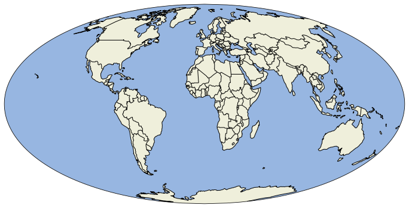

En este tutorial veremos una pequeña introducción a la librería `cartopy` para la visualización geoespacial en Python. Para más información de la librería visitar la [documentación](https://scitools.org.uk/cartopy/docs/latest/index.html). 

<br>

> **Nota**: La forma más sencilla de instalar `cartopy` es utilizando `conda` en lugar de usar `pip`.

<br>

`cartopy` es una librería compatible con `matplolib` para graficar datos geoespaciales. Los mapas se ponen en una representación 2D. Existen muchas proyecciones que se pueden utilizar para representar el mapa, para fines de este tutorial se utilizará principalmente las proyecciones `PlateCarree` y `Mollweide`, para conocer otras proyecciones disponibles visitar la [documentación](https://scitools.org.uk/cartopy/docs/latest/reference/projections.html#cartopy-projection-list).

La forma más sencilla de inicializar un mapa es usar la función `plt.axes()` de `matplotlib.pyplot` y usar el parámetro `projection=Mollweide()`. De esta forma se retornará un objeto `GeoAxes`. Para que efectivamente se muestre un mapa se debe usar el método `GeoAxes.coastlines()` o `GeoAxes.stock_img()`, ya que en caso contrario solo se mostará una figura en blanco.


```python
# Importar módulos y funciones
import matplotlib.pyplot as plt
from cartopy.crs import Mollweide

# Definir el tamaño de la figura
plt.figure(figsize=(12, 8))

# Inicializar axis y agregar coastlines
ax = plt.axes(projection=Mollweide())
ax.coastlines()
plt.show()
```


    

    


Veamos ahora un ejemplo de la proyección `PlateCarree` usando el método `GeoAxes.stock_img()`.


```python
# Importar función
from cartopy.crs import PlateCarree

# Definir el tamaño de la figura
plt.figure(figsize=(12, 8))

# Inicializar axis y agregar stock_img
ax = plt.axes(projection=PlateCarree())
ax.stock_img()
plt.show()
```


    

    


Para conocer más métodos del objeto `GeoAxes` visitar la [documentación](https://scitools.org.uk/cartopy/docs/latest/reference/generated/cartopy.mpl.geoaxes.GeoAxes.html?highlight=coastlines#cartopy-mpl-geoaxes-geoaxes) de `cartopy`.

> **Nota**: En los ejemplos anteriores es posible añadir tanto `coastlines()` como `stock_img()` al mismo tiempo.

<br>

Una vez inicializado un mapa se pueden agregar elementos al mapa con el método `GeoAxes.add_feature()`. Algunos de los elementos más populares son:
- Agregar color a los oceános, particularmente útil si se utilizó `coastlines()`.
- Agregar color a las tierras continentales, particularmente útil si se utilizó `coastlines()`.
- Agregar fronteras de los países.
- Agregar frontera de estados, únicamente disponible para Estados Unidos.

Para una lista completa de los _features_ disponibles visitar la [documentación](https://scitools.org.uk/cartopy/docs/latest/reference/feature.html).


```python
# Importar módulos y funciones
import cartopy

# Definir el tamaño de la figura
plt.figure(figsize=(12, 8))

# Inicializar axis y agregar coastlines
ax = plt.axes(projection=Mollweide())
ax.coastlines()

# Frontera de los países
ax.add_feature(cartopy.feature.BORDERS)
# Color a tierras continentales
ax.add_feature(cartopy.feature.LAND)
# Color a los oceános
ax.add_feature(cartopy.feature.OCEAN)
plt.show()
```


    

    


Es posible hacer zoom para mostrar solo una porción del mapa, para ello se utiliza el método `set_extent()`. En este método se debe indicar las longitudes y latitutes máximas y mínimas a mostrar de la siguiente manera `(min_lon, max_lon, min_lat, max_lat)`.

Para identificar las longitudes y latitutes de una región geográfica se puede utilizar como referencia la siguiente imagen


Las longitudes son las medidas horizontales, mientras que las latitudes son las medidadas verticales. Tener en cuenta que, las longitudes a la izquierda de cero se deben de poner como números negativos y las latitutes por debajo de cero también se deben de poner como número negativos. 

A continuación haremos zoom al subcontinente de sudamérica, que de acuerdo al mapa está aproximadamente entre las longitudes -90 y -30 y entre las latitudes -60 y 15. Se utilizará una proyección `PlateCarree()` para una mejor visualización


```python
# Definir el tamaño de la figura
plt.figure(figsize=(12, 8))

# Inicializar axis y agregar coastlines
ax = plt.axes(projection=PlateCarree())

# Establecer extensión del mapa
south_america_extent = (-90, -30, -60, 15)
ax.set_extent(south_america_extent)

# Añadir coastlines
ax.coastlines()

# Frontera de los países
ax.add_feature(cartopy.feature.BORDERS)
# Color a tierras continentales
ax.add_feature(cartopy.feature.LAND)
# Color a los oceános
ax.add_feature(cartopy.feature.OCEAN)
plt.show()
```


    

    


Finalmente revisaremos cómo añadir puntos y líneas, por ejemplo, para representar ciudades usando funciones y métodos de `matplotlib`.

Para añadir ciudades se debe indicar la longitud y latitud de la ciudad, una librería que podría ser útil para obtener las longitudes y latitutes de ciudades es la librería de Python `Geonamescache`, para más información visitar [esta página](https://openbase.com/python/geonamescache/documentation).

En este caso mostraremos las ciudades de Ciudad de México en México y de Sao Paulo en Brasil, usando el método `Axes.plot()`, para crear una línea entre ambas ciudades.


```python
# Definir el tamaño de la figura
plt.figure(figsize=(12, 8))

# Inicializar axis y agregar coastlines
ax = plt.axes(projection=PlateCarree())

# Establecer extensión del mapa
latin_america_extent = (-120, -30, -50, 25)
ax.set_extent(latin_america_extent)

# Establecer lat y lon de las ciudades
sp_lon, sp_lat = -46, -23
cdmx_lon, cdxm_lat = -99, 19

# Añadir coastlines y stock_img
ax.stock_img()
ax.coastlines()

# Frontera de los países
ax.add_feature(cartopy.feature.BORDERS)

# Graficar las ciudades y una línea entre ellas
ax.plot([sp_lon, cdmx_lon], [sp_lat, cdxm_lat],
         color='blue', linewidth=2, marker='o',
         transform=PlateCarree(),
         )

plt.show()
```


    

    


Este post está basado en la sección 11 del libro _Data Science Bookcamp_ (Apeltsin L., 2021), para más información de este libro visitar esta [página](https://www.manning.com/books/data-science-bookcamp). 
