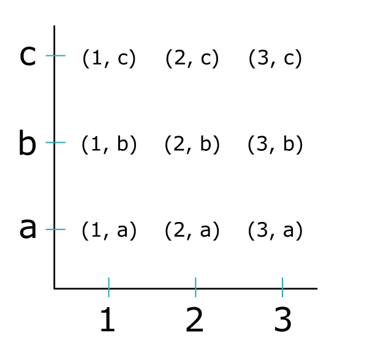
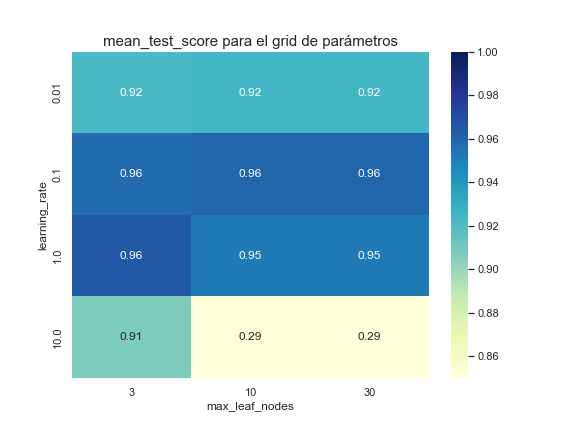

En este tutorial veremos cómo utilizar la función `GridSearchCV` de la librería `scikit-learn` de Python. Esta función se utiliza para optimizar hiperparámetros de modelos en _supervised learning_ o también para elegir modelos o tranformadores que resulten en el mejor desempeño. Cabe resaltar que existen otras funciones de optimización que no se tratan en este tutorial pero que se pueden conocer en la [guía de usuario](https://scikit-learn.org/stable/modules/classes.html#hyper-parameter-optimizers) y en la [referencia de la API](https://scikit-learn.org/stable/modules/classes.html#hyper-parameter-optimizers) de `sklearn`.

**Importante**: El objetivo de este tutorial es simplemente mostrar cómo implementar esta función. En el tutorial no se profundarizará en la teoría de optimización de hiperparámetros y se da por hecho que el lector conoce conceptos relacionados con _supervised learning_ y conoce la API de `scikit-learn`.

## Grid Search

Grid search es una técnica en la que se entrena un mismo modelo múltiples veces para diferentes combinaciones de valores de los hiperparámetros. En grid search se evaluan todas las posibles combinaciones de los valores por lo que puede llegar a ser costo computacionalmente. Su uso se recomienda para probar una cantidad relativamente pequeña de valores o hiperparámetros.

En `scikit-learn` se implementa grid search con la clase `GridSearcCV`, esta clase recibe como argumento un `estimator` (modelo) que será entrenado para los difentes valores de un _grid_ de parámetros. Un _grid_ de parámetros se puede entender como el [producto cartesiano](https://es.wikipedia.org/wiki/Producto_cartesiano) de los valores de los parámetros a evaluar. 

Por ejemplo, si se quisiera evaluar la mejor combinación de los hipérparámetros `hyp1` e `hyp2` de un modelo para 3 valores diferentes de cada hiperparámetros, entonces al final se evaluarían 9 modelos distintos que corresponderían a las 9 combinaciones posible de los valores de `hyp1` e `hyp2`. Esto se puede visualizar con la función `product()` del módulo `itertools`


```python
# Importar la función
from itertools import product

# Definir posible valores de los hiperparámetros
hyp1 = [1, 2, 3]
hyp2 = ['a', 'b', 'c']

# Calcular todas las combinaciones únicas
print(*product(hyp1, hyp2))
```

    (1, 'a') (1, 'b') (1, 'c') (2, 'a') (2, 'b') (2, 'c') (3, 'a') (3, 'b') (3, 'c')


Visualmente, el producto cartesiano de dos conjuntos equivaldría a poner los elementos de un conjunto en un eje y los elementos del otro conjunto en el otro eje y determinar todas las combinaciones de los elementos.




En `scikit-learn` la forma como se implementa Grid-Search es con la función `GridSearchCV` del modulo `sklearn.model_selection`. Esta función además de aplicar un grid search también aplica un _cross validation_ en cada modelo. Los principales parámetros de esta función son:
- `param_grid`: Es un diccionario que indica los hipérparametros a evaluar y cuyos valores son una lista con los valores a probar.
- `estimator`: El modelo a usar.
- `cv`: Estrategia de cross validation a implementar.

Para obtener más información de la función consultar la [documentación](https://scikit-learn.org/stable/modules/generated/sklearn.model_selection.GridSearchCV.html#sklearn-model-selection-gridsearchcv) de `scikit-learn`.


Para ver cómo implementar esta función primero importaremos unos datos. En esta ocasión utilizaremos el dataset `breast cancaer` del módulo `sklearn.datasets`. Todos los _features_ de este dataset son valores numéricos, por lo que no será necesario preprocesarlos. El _target_ es un valor categórico que puede ser {Malignant, Benign}. Para más información sobre este dataset visitar la [documentación](https://scikit-learn.org/stable/datasets/toy_dataset.html#breast-cancer-wisconsin-diagnostic-dataset).


```python
# Importar función
from sklearn.datasets import load_breast_cancer

# Importar los datos
X, y = load_breast_cancer(return_X_y=True)
```

Con los datos importados procederemos a hacer un train-test split con la función `train_test_split` del módulo `sklearn.model_selection`.


```python
# Importar la función
from sklearn.model_selection import train_test_split

# Hacer el split
X_train, X_test, y_train, y_test = train_test_split(X, y, test_size = 0.3)
```

Ahora procederemos a aplicar el grid search. Utilizaremos como modelo un _hist gradient boosting classifier y probaremos algunos valores para los hiperparámetro `learning_rate` y `max_depth`.


```python
# Importar funciones
import numpy as np
from sklearn.ensemble import HistGradientBoostingClassifier
from sklearn.model_selection import GridSearchCV

# Definir el param_grid
param_grid = {
    'learning_rate': (0.01, 0.1, 1, 10),
    'max_leaf_nodes': (3, 10, 30)}

# Inicializar el modelo
clsff = HistGradientBoostingClassifier(max_leaf_nodes=4)

# Inicializar el grid search
clsff_cv = GridSearchCV(clsff, param_grid, cv = 2)

# Ajustar el grid search a los datos del train
clsff_cv.fit(X_train, y_train)
```


<style>#sk-container-id-2 {color: black;background-color: white;}#sk-container-id-2 pre{padding: 0;}#sk-container-id-2 div.sk-toggleable {background-color: white;}#sk-container-id-2 label.sk-toggleable__label {cursor: pointer;display: block;width: 100%;margin-bottom: 0;padding: 0.3em;box-sizing: border-box;text-align: center;}#sk-container-id-2 label.sk-toggleable__label-arrow:before {content: "▸";float: left;margin-right: 0.25em;color: #696969;}#sk-container-id-2 label.sk-toggleable__label-arrow:hover:before {color: black;}#sk-container-id-2 div.sk-estimator:hover label.sk-toggleable__label-arrow:before {color: black;}#sk-container-id-2 div.sk-toggleable__content {max-height: 0;max-width: 0;overflow: hidden;text-align: left;background-color: #f0f8ff;}#sk-container-id-2 div.sk-toggleable__content pre {margin: 0.2em;color: black;border-radius: 0.25em;background-color: #f0f8ff;}#sk-container-id-2 input.sk-toggleable__control:checked~div.sk-toggleable__content {max-height: 200px;max-width: 100%;overflow: auto;}#sk-container-id-2 input.sk-toggleable__control:checked~label.sk-toggleable__label-arrow:before {content: "▾";}#sk-container-id-2 div.sk-estimator input.sk-toggleable__control:checked~label.sk-toggleable__label {background-color: #d4ebff;}#sk-container-id-2 div.sk-label input.sk-toggleable__control:checked~label.sk-toggleable__label {background-color: #d4ebff;}#sk-container-id-2 input.sk-hidden--visually {border: 0;clip: rect(1px 1px 1px 1px);clip: rect(1px, 1px, 1px, 1px);height: 1px;margin: -1px;overflow: hidden;padding: 0;position: absolute;width: 1px;}#sk-container-id-2 div.sk-estimator {font-family: monospace;background-color: #f0f8ff;border: 1px dotted black;border-radius: 0.25em;box-sizing: border-box;margin-bottom: 0.5em;}#sk-container-id-2 div.sk-estimator:hover {background-color: #d4ebff;}#sk-container-id-2 div.sk-parallel-item::after {content: "";width: 100%;border-bottom: 1px solid gray;flex-grow: 1;}#sk-container-id-2 div.sk-label:hover label.sk-toggleable__label {background-color: #d4ebff;}#sk-container-id-2 div.sk-serial::before {content: "";position: absolute;border-left: 1px solid gray;box-sizing: border-box;top: 0;bottom: 0;left: 50%;z-index: 0;}#sk-container-id-2 div.sk-serial {display: flex;flex-direction: column;align-items: center;background-color: white;padding-right: 0.2em;padding-left: 0.2em;position: relative;}#sk-container-id-2 div.sk-item {position: relative;z-index: 1;}#sk-container-id-2 div.sk-parallel {display: flex;align-items: stretch;justify-content: center;background-color: white;position: relative;}#sk-container-id-2 div.sk-item::before, #sk-container-id-2 div.sk-parallel-item::before {content: "";position: absolute;border-left: 1px solid gray;box-sizing: border-box;top: 0;bottom: 0;left: 50%;z-index: -1;}#sk-container-id-2 div.sk-parallel-item {display: flex;flex-direction: column;z-index: 1;position: relative;background-color: white;}#sk-container-id-2 div.sk-parallel-item:first-child::after {align-self: flex-end;width: 50%;}#sk-container-id-2 div.sk-parallel-item:last-child::after {align-self: flex-start;width: 50%;}#sk-container-id-2 div.sk-parallel-item:only-child::after {width: 0;}#sk-container-id-2 div.sk-dashed-wrapped {border: 1px dashed gray;margin: 0 0.4em 0.5em 0.4em;box-sizing: border-box;padding-bottom: 0.4em;background-color: white;}#sk-container-id-2 div.sk-label label {font-family: monospace;font-weight: bold;display: inline-block;line-height: 1.2em;}#sk-container-id-2 div.sk-label-container {text-align: center;}#sk-container-id-2 div.sk-container {/* jupyter's `normalize.less` sets `[hidden] { display: none; }` but bootstrap.min.css set `[hidden] { display: none !important; }` so we also need the `!important` here to be able to override the default hidden behavior on the sphinx rendered scikit-learn.org. See: https://github.com/scikit-learn/scikit-learn/issues/21755 */display: inline-block !important;position: relative;}#sk-container-id-2 div.sk-text-repr-fallback {display: none;}</style><div id="sk-container-id-2" class="sk-top-container"><div class="sk-text-repr-fallback"><pre>GridSearchCV(cv=2, estimator=HistGradientBoostingClassifier(max_leaf_nodes=4), param_grid={&#x27;learning_rate&#x27;: (0.01, 0.1, 1, 10), &#x27;max_leaf_nodes&#x27;: (3, 10, 30)})</pre><b>In a Jupyter environment, please rerun this cell to show the HTML representation or trust the notebook. <br />On GitHub, the HTML representation is unable to render, please try loading this page with nbviewer.org.</b></div><div class="sk-container" hidden><div class="sk-item sk-dashed-wrapped"><div class="sk-label-container"><div class="sk-label sk-toggleable"><input class="sk-toggleable__control sk-hidden--visually" id="sk-estimator-id-4" type="checkbox" ><label for="sk-estimator-id-4" class="sk-toggleable__label sk-toggleable__label-arrow">GridSearchCV</label><div class="sk-toggleable__content"><pre>GridSearchCV(cv=2, estimator=HistGradientBoostingClassifier(max_leaf_nodes=4), param_grid={&#x27;learning_rate&#x27;: (0.01, 0.1, 1, 10),  &#x27;max_leaf_nodes&#x27;: (3, 10, 30)})</pre></div></div></div><div class="sk-parallel"><div class="sk-parallel-item"><div class="sk-item"><div class="sk-label-container"><div class="sk-label sk-toggleable"><input class="sk-toggleable__control sk-hidden--visually" id="sk-estimator-id-5" type="checkbox" ><label for="sk-estimator-id-5" class="sk-toggleable__label sk-toggleable__label-arrow">estimator: HistGradientBoostingClassifier</label><div class="sk-toggleable__content"><pre>HistGradientBoostingClassifier(max_leaf_nodes=4)</pre></div></div></div><div class="sk-serial"><div class="sk-item"><div class="sk-estimator sk-toggleable"><input class="sk-toggleable__control sk-hidden--visually" id="sk-estimator-id-6" type="checkbox" ><label for="sk-estimator-id-6" class="sk-toggleable__label sk-toggleable__label-arrow">HistGradientBoostingClassifier</label><div class="sk-toggleable__content"><pre>HistGradientBoostingClassifier(max_leaf_nodes=4)</pre></div></div></div></div></div></div></div></div></div></div>


Con el modelo entrenado podemos recuperar información sobre la combinación de valores de los hipérparámetros que tuvieron el mejor desempeño, para ello podemos utilizar los atributos `GridSearchCV.best_params_` y `GridSearchCV.best_score_`.


```python
# Imprimir la combinación con mejor desempeño
print(f"Mejores hiperparámetros: {reg_cv.best_params_}")


# Imprimir el mejor score obtenido
print(f"Mejor score: {reg_cv.best_score_}")
```

    Mejores hiperparámetros: {'learning_rate': 1, 'max_leaf_nodes': 3}
    Mejor score: 0.964824120603015


También es posible acceder al mejor modelo y utilizar este modelo para hacer predicciones en datos nuevos. En este ejemplo utilizaremos el modelo retornado por el atributo `GridSearchCV.best_estimator_` para evaluar el test set


```python
# Recuperar el mejor modelo
best_model = reg_cv.best_estimator_

# Calcular el score en el test set
test_score = best_model.score(X_test, y_test)

# Imprimir el score
print(f"Test score: {test_score:.3f}")
```

    Test score: 0.988


Además es posible acceder a los resultados de todos los cross validation hechos para cada combinación de valores de los hiperparámetros con el atributo `GridSearchCV.cv_results_`. Este atributo retorna un diccionario. Para manipular mejor esta información la convertiremos a un `DataFrame` de la librería `pandas`.


```python
import pandas as pd

cv_result_df = pd.DataFrame(reg_cv.cv_results_)

print(cv_result_df.info())
```

    <class 'pandas.core.frame.DataFrame'>
    RangeIndex: 12 entries, 0 to 11
    Data columns (total 12 columns):
     #   Column                Non-Null Count  Dtype  
    ---  ------                --------------  -----  
     0   mean_fit_time         12 non-null     float64
     1   std_fit_time          12 non-null     float64
     2   mean_score_time       12 non-null     float64
     3   std_score_time        12 non-null     float64
     4   param_learning_rate   12 non-null     object 
     5   param_max_leaf_nodes  12 non-null     object 
     6   params                12 non-null     object 
     7   split0_test_score     12 non-null     float64
     8   split1_test_score     12 non-null     float64
     9   mean_test_score       12 non-null     float64
     10  std_test_score        12 non-null     float64
     11  rank_test_score       12 non-null     int32  
    dtypes: float64(8), int32(1), object(3)
    memory usage: 1.2+ KB
    None


Podría ser interesante visualizar un mapa de calor del `mean_test_score` para cada combinación de valores de `learning_rate` y `max_leaf_nodes`. Para ellos seleccionaremos las columnas correspondientes, le daremos el formato correcto y lo graficaremos con la función `seaborn.heatmap()`. Para más información sobre los mapas de calor se puede visitar este [post](https://angelizaldi.me/post/seaborn-heatmap/).


```python
# Seleccionar las columnas
my_df = cv_result_df[["param_learning_rate", "param_max_leaf_nodes", "mean_test_score"]].copy()

# Renombrar columnas
my_df.rename({"param_learning_rate": "learning_rate", "param_max_leaf_nodes": "max_leaf_nodes"}, 
             inplace=True,
             axis=1)

# Convertir a pivot
data_heatmap = my_df.pivot("learning_rate", "max_leaf_nodes", "mean_test_score")

# Imprimir
display(data_heatmap)
```

| max_leaf_nodes | 3     | 10    | 30    |
|:---------------|:-----:|:-----:|:-----:|
| learning_rate  |       |       |       |
| 0.01           | 0.922 | 0.925 | 0.925 |
| 0.1            | 0.957 | 0.959 | 0.959 |
| 1.0            | 0.965 | 0.952 | 0.952 |
| 10.0           | 0.907 | 0.289 | 0.289 |


Con los datos listos podemos proceder a graficar el mapa de calor


```python
# Importar módulo
import seaborn as sns

# Establecer el tamaño de la gráfica
sns.set(rc={'figure.figsize':(8, 6)})

# Graficar mapa de calor
ax = sns.heatmap(data_heatmap,
            # Paleta de colores
            cmap="YlGnBu",
            # Valor máximo de la barra de color
            vmax=1,
            # Valor mínimo de la barra de color
            vmin=.85,
            # Para indicar que imprima el valor de cada celda
            annot=True)

# Agregar un título a la gráfica
_ = ax.set_title("mean_test_score para el grid de parámetros", size=15)
```



Como se puede observar en general los mejores desempeños se dan cuando `leargning_rate` es 1.0 o 0.1, independientemente del valor de `max_leaf_nodes`.
