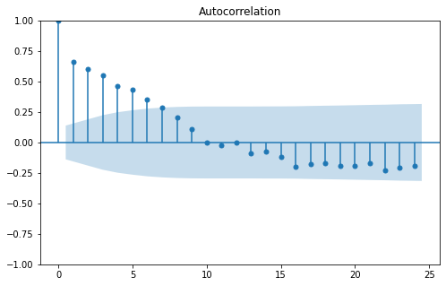

En este tutorial revisaremos cómo simular procesos AR(p), MA(q) y ARMA(p, q) en Python usando la librería `statsmodels`. Para este tutorial se da por hecho que el lector está familiarizado con conceptos básicos de series de tiempo como tendencia, procesos estacionales, autocorrelación y autocorrelogramas.

Para este tutorial utilizaremos las siguientes librerías de Python:
- `matplotlib.pyplot` para graficar.
- `statsmodels` para simular los procesos AR(p), MA(q) y ARMA(p, q) y para graficar autocorrelogramas.
- `numpy.random` para generar números pseudo aleatorios.

## Preliminares

Antes de entrar en detalles de cómo simular procesos modelos AR(p), MA(q) y ARMA(p, q) revisaremos cómo simular un ruido blanco y una caminata aleatoria.

### Ruido blanco

Un ruido blanco (_white noise_) en un proceso en el que cada observación no está relacionada con la observación anterior. Esto quiere decir que cada observación es aleatoria. Un ruido blanco tiene las siguientes características:
- Media constante.
- Varianza constante.
- Autocorrelación de cero en todos los desfases.

La forma más sencilla de simular un ruido blanco en con un generador de números aleatorios de una distribución normal, para ello se puede usar el módulo `random` de `numpy` o `stats` de `scipy` en este tutorial utilizaremos `numpy.random`. Esta función recibe como parámetros la media, varianza y el número de números aleatorios a generar.


```python
# Importar función
from numpy.random import normal

# Simular un ruido blanco
white_noise = normal(0, 1, 200)
```

En este caso se generó un ruido blanco de una distribución normal estándar, es decir, un ruido blanco con media de cero y varianza de 1. Sin embargo, es importante resaltar que un ruido blanco puede tener una media diferente de cero y/o una varianza diferente de 1.

Para observar cómo se ve un ruido blanco lo graficaremos con `matplotlib.pyplot`


```python
# Importar pyplot
import matplotlib.pyplot as plt

# Definir tamaño de la gráfica
plt.rc("figure", figsize=(8,5))

# Graficar el ruido blanco y agrear un título
plt.plot(white_noise, color="#30838C")
plt.title("Simulación de un ruido blanco", size=20)

# Añadir una recta en la media cero
_ = plt.axhline(0, color="#60ceda")
```


    

    


Podemos además revisar que la autocorrelación del ruido blanco sea cero en todos los desfases, para ello utilizaremos la función `plot_acf` de `statsmodels`


```python
# Importar función
from statsmodels.graphics.tsaplots import plot_acf

# Graficar el autocorrelograma para el ruido blanco
_ = plot_acf(white_noise)
```


    

    


Como podemos observar ningún desfase es significativo, salvo el 5, pero podría ser debido a aleatoriedad.

### Caminata Aleatoria

Una camita aleatoria (_random walk_) es un proceso cuyo observación actual depende de la observación anterior más un valor aleatorio, es decir, una ruido blanco. Matemáticamente se expresaría como:

$$
    Y_t = Y_{t-1}+\epsilon_t
$$

Donde:
- $Y_t$ es la observación en el tiempo $t$ (actual).
- $Y_{t-1}$ es la observación en el tiempo $t-1$ (anterior).
- $\epsilon_t$ es un ruido blanco.

Es común también representar una caminata aleatoria como

$$
    Y_t = \mu + Y_{t-1}+\epsilon_t
$$

Donde:
- $\mu$ es la media del ruido blanco. Más adelante se explicará las consecuencias que tiene en la caminata aleatoria si el ruido blanco tienen $\mu\neq 0$.

Para simular una caminata aleatoria se puede definir un valor inicial $Y_0$ y concatenarlo al inicio de un ruido blanco y calcular una suma acumulada del array:


```python
# Importar numpy
import numpy as np

# Definir un valor inicial
y0 = 100

# Simular una caminata aleatoria
random_walk = np.cumsum(np.r_[y0, white_noise])

# Graficar la simulación de camita aleatoria
plt.plot(random_walk)
_ = plt.title("Simulación de una caminata aleatoria", size=20)
```


    

    


Una caminata aleatoria depende complementamente del ruido blanco subyacente. A continuación se presenta cómo afecta las características del ruido blanco a la caminata aleatoria:
- Si el rudio blanco tiene una media mayor a cero o menor a cero la caminata aleatoria tendrá una tendencia positiva o negativa, respectivamente. 
- Entre mayor sea la varianza más oscilante será la camita aleatoria y en caso de que la caminata aleatoria tenga una tendencia, más inestable será ésta. Entre mayor sea la varianza menor será el efecto de la tendencia y viceversa, por ejemplo, una varianza de cero implicaría que el ruido es una línea recta.

Por ejemplo, una caminata aleatoria con una media de -1 y una varianza de 3 se espera que tenga una tendencia negativa, que oscila moderadamente.


```python
# Ruido blanco con media de 1 y varianza de 5
white_noise_pos = normal(-1, 5, 200)

# Simular  y grafica la caminata aleatoria
y0 = 100
# Para concatenar y0 y el ruido blanco usamos np.r_[...]
random_walk_pos = np.cumsum(np.r_[y0, white_noise_pos])

plt.plot(random_walk_pos)
_ = plt.title("Simulación de una caminata aleatoria", size=20)
```


    

    


El autocorrelograma de una camita aleatoria muestra autocorrelaciones positivas que van disminuyendo conforme aumenta el número de desfases.


```python
# Graficar el autocorrelograma de una caminata aleatoria
_ = plot_acf(random_walk)
```


    

    


## AR(p)

Un modelo autoregresivo (autoregressive) (AR) es un proceso en el que la observación actual depende de una constante, que sería la media del proceso, una fracción de la observación anterior, determinado por el parámetro $\phi$ y un ruido blanco. Matemáticamete se expresaría como:

$$
    Y_t = \mu + \phi \cdot Y_{t-1} + \epsilon_t 
$$

Donde: 
- $Y_t$ es la observación en el tiempo $t$ (actual).
- $Y_{t-1}$ es la observación en el tiempo $t-1$ (anterior).
- $\mu$ es la media del ruido blanco.
- $\phi$ es una proporción que determina que tan autocorrelacionado está $Y_t$ con las observaciones anteriores, entre más grande, mayor será la autocorrelación.
- $\epsilon_t$ es un ruido blanco.

El valor del parámetro $\phi$ determina el comportamiento del proceso (bajo el supuesto de una varianza de 1):
- Si $\phi=0$ entonces es un ruido blanco con media $\mu$.
- Si $\phi=1$ entonces en una caminata aleatoria cuyo ruido blanco tiene media $\mu$.
- Si $\phi>0$ entonces es más probable que la observación actual tenga el mismo signo que la observación anterior.
- Si $\phi<0$ entonces es más probable que el proceso oscile.
- Si se desea que el proceso simulado sea estacionario entonces $-1<\phi<1$.

<br>
<br>


Para simular un modelo autoregresivo se puede usar la función `arma_generate_sample()` indicando el valor de $\phi$. <span style="color:red; font-weight: bold;">Importante</span>: Tener en cuenta las siguientes características al momento de definir el parámetro:
- El parámetro se debe pasar con el signo contrario al que se desea que tenga.
- El parámetro se debe pasar como lista cuyo primer elemento sea un 1 y el segundo $\phi$, más adelante se explicará la razón de esto.
- Por lo tanto el parámetro `ar` se debe de definir como `ar=[1, -phi]`.
- Para más información visitar la [documentación](https://www.statsmodels.org/stable/generated/statsmodels.tsa.arima_process.arma_generate_sample.html#statsmodels.tsa.arima_process.arma_generate_sample) oficial de statsmodels.

Tener en cuenta además que la función recibe el parámetro `ma` correspondiente al modelo de promedio móvil que se verá más adelante, por el momento definir el parámetro como `ma=[1]`.

> **Nota**: Además de la función `arma_generate_sample()`, se puede usar la clase `ArmaProcess` para simular procesos AR, MA o ARMA, del módulo `statsmodels.tsa.api` y posteriormente usar el método `.generate_sample(n)`. Para más información visitar la [documentación](https://www.statsmodels.org/stable/generated/statsmodels.tsa.arima_process.ArmaProcess.html#statsmodels.tsa.arima_process.ArmaProcess) de statsmodels.

Se realizará la simulación de 3 modelos AR(1) para diferente valores de $\phi$ para visualizar su comportamiento:


```python
# Importar la función
from statsmodels.tsa.api import arma_generate_sample

# Crear la figura y axes
fig, ax = plt.subplots(1, 3, figsize=(15, 5))

# Definir los valores de phi
phis = [-0.9, 0, 0.9]

# Simular el modelo AR(p) y graficar
for i, phi in enumerate(phis):
    ar = arma_generate_sample(ar=[1, -phi], ma=[1], nsample=200)
    ax[i].plot(ar)
    ax[i].set_title(f"$\phi$={phi}", size=20)
```


    

    


Como se puede observar en las gráficas:
- Cuando $\phi=-0.9$ entonces el proceso oscila alrededor de la media (cero).
- Cuando $\phi=0$ entonces el proceso es un ruido blanco, en este caso con media de cero.
- Cuando $\phi=0.9$ entonces el proceso se asimila más a una caminata aleatoria, donde el valor actual depende más del anterior.

<br>
Ahora de graficará el autocorrelograma para distintos valores de $\phi$.


```python
# Simular el modelo AR(p) y graficar
fig, ax = plt.subplots(1, 3, figsize=(15, 5))

phis = [-0.9, 0, 0.9]

for i, phi in enumerate(phis):
    ar = arma_generate_sample(ar=[1, -phi], ma=[1], nsample=200)
    plot_acf(ar, ax=ax[i])
    ax[i].set_title(f"$\phi$={phi}", size=20)
```


    

    


Como podemos observar en las gráficas:
- Cuando $\phi=-0.9$ entonces el autocorrelograma oscila entre valores positivos y negativos.
- Cuando $\phi=0$ es el autocorrelograma de un ruido blanco.
- Cuando $\phi=0.9$ el autocorrelograma es similar al de una caminata aleatoria en el que el valor de las autocorrelaciones positivas van disminuyendo conforme aumenta el número de desfases.

### Modelos de orden superior

Los modelos AR(p) que acabamos de simular corresponden a modelos de orden 1, es decir, que tiene un único parámetro $\phi$ asociado con el desfase 1, es decir con $Y_{t-1}$, sin embargo, existen modelos de orden superior en el que hay más de un parámetro $\phi_i$ asociado con cada desfase $i$, es decir $t-i$. Por ejemplo un modelo AR de segundo orden, denotado por AR(2), se expresa como:

$$
    Y_t = \mu + \phi_1 \cdot Y_{t-1} + \phi_2 \cdot Y_{t-2} + \epsilon_t 
$$

En este caso $Y_t$ no solo depende directamente de $Y_{t-1}$, sino también de $Y_{t-2}$, esas relaciones están determinadas por los parámetros $\phi_1$ y $\phi_2$ respectivamente. 

Para simular un mode AR de orden superior con la función `arma_generate_sample()` se debe pasar tantos parámetros $\phi_i$ como el orden del modelo en el argumento `ar`. Recordar que anteriorme definimos el argumento `ar` como `ar=[1,-phi]`, lo cual correspondería a un modelo de orden uno, ahora un modelo de orden 2 se definiría como `ar=[1, -phi1, -phi2]`. La razón por la cual se incluye un 1 al inicio de la lista es porque el 1 corresponde al $\phi_0$ del desfase cero y usualmente este es un 1.

Ahora simularemos un proceso AR(2)


```python
ar2 = arma_generate_sample(ar=[1, -.7, -.3], ma=[1], nsample=200)

plt.plot(ar2)
_ = plt.title("AR de orden 2", size=20)
```


    

    


Una forma sencilla de identificar el orden un de un proceo AR(_n_) es graficando el autocorrelograma parcial con la función `plot_pacf` del módulo `statsmodels.graphics.tsaplots`. El número de desfases significativos, sin incluir el desfase cero, será el orden del proceso.


```python
# Importar función
from statsmodels.graphics.tsaplots import plot_pacf

# Graficar el autocorrelograma parcial
# Se espera que tenga 2 desfases significativos, excluyendo el desfase 0
_ = plot_pacf(ar2, method='ywm')
```


    

    


## MA(q)

Un modelo de promedio móvil (movil average) (MA) es un proceso en el que la observación actual depende de una constante, que sería la media del proceso, un ruido blanco y una fracción del ruido blanco anterior. Matemáticamete se expresaría como:

$$
    Y_t = \mu + \epsilon_t + \theta\cdot\epsilon_{t-1}
$$

Donde: 
- $Y_t$ es la observación en el tiempo $t$ (actual).
- $\mu$ es la media del ruido blanco.
- $\epsilon_t$ es un ruido blanco en el tiempo $t$.
- $\theta$ es una fracción.
- $\epsilon_t$ es un ruido blanco en el tiempo $t-1$.

El valor del parámetro $\theta$ determina el comportamiento del proceso (bajo el supuesto de $\epsilon_t$ positivos):
- Si $\theta=0$ entonces es un ruido blanco con media $\mu$.
- Si $\phi>0$ entonces es más probable que la observación actual tenga el mismo signo que la observación anterior. Entre mayor sea este valor más autocorrelacionado estará el proceso.
- Si $\phi<0$ entonces es más probable que el proceso oscile.
- MA es un proceso estacionario para todos los valores de $\theta$.

<br>
<br>

Para simular un modelo de promedio móvil se puede usar la función `arma_generate_sample()` indicando el valor de $\theta$. **Importante**: Tener en cuenta las siguientes características al momento de definir el parámetro:
- El parámetro se debe pasar como lista cuyo primer elemento sea un 1 y el segundo $\theta$, más adelante se explicará la razón de esto.
- Por lo tanto el parámetro `ma` se debe de definir como `ma=[1, theta]`.
- Para más información visitar la [documentación](https://www.statsmodels.org/stable/generated/statsmodels.tsa.arima_process.arma_generate_sample.html#statsmodels.tsa.arima_process.arma_generate_sample) oficial de statsmodels.

Tener en cuenta además que la función recibe el parámetro `ar` correspondiente al modelo autoregresivo que se vió anteriormente, por el momento definir el parámetro como `ar=[1]`.

> **Nota**: Además de la función `arma_generate_sample()`, se puede usar la clase `ArmaProcess` del módulo `statsmodels.tsa.api`, para simular procesos AR, MA o ARMA  y posteriormente usar el método `.generate_sample(n)`. Para más información visitar la [documentación](https://www.statsmodels.org/stable/generated/statsmodels.tsa.arima_process.ArmaProcess.html#statsmodels.tsa.arima_process.ArmaProcess) de statsmodels.

Se realizará la simulación de 3 modelos MA(1) para diferente valores de $\theta$ para visualizar su comportamiento:


```python
# Importar la función
from statsmodels.tsa.api import arma_generate_sample

# Crear la figura y axes
fig, ax = plt.subplots(1, 3, figsize=(15, 5))

# Definir los valores de theta
thetas = [-0.9, 0, 0.9]

# Simular el modelo MA(p) y graficar
for i, theta in enumerate(thetas):
    ma = arma_generate_sample(ar=[1], ma=[1, theta], nsample=200)
    ax[i].plot(ma)
    ax[i].set_title(fr"$\theta$={theta}", size=20)
```


    

    


Como podemos observar en las gráficas para valores negativos de $\theta$ el proceso oscila más que para valores positivos de $\theta$. Y si $\theta=0$ entonces en un ruido blanco, en este caso con media de cero.


<br>
Ahora de graficará el autocorrelograma para distintos valores de $\theta$.


```python
# Simular el modelo MA(1) y graficar
fig, ax = plt.subplots(1, 3, figsize=(15, 5))

thetas = [-0.9, 0, 0.9]

for i, theta in enumerate(thetas):
    ma = arma_generate_sample(ar=[1], ma=[1, theta], nsample=200)
    plot_acf(ma, ax=ax[i])
    ax[i].set_title(fr"$\theta$={theta}", size=20)
```


    

    


Como podemos observar en las gráficas:
- Cuando $\theta=-0.9$ entonces el autocorrelograma tiene un único desfase significativo, con una autocorrelación negativa.
- Cuando $\phi=0$ es el autocorrelograma de un ruido blanco.
- Cuando $\phi=0.9$ el autocorrelograma tiene un único desfase significativo, con una autocorrelación positiva.

### Modelos de orden superior

Los modelos MA que acabamos de simular corresponden a modelos de orden 1, es decir, que tiene un único parámetro $\theta$ asociado con el desfase 1 del ruido blanco, es decir con $\epsilon_{t-1}$, sin embargo, existen modelos de orden superior en el que hay más de un parámetro $\theta_i$ asociado con cada desfase $i$, es decir $t-i$. Por ejemplo un modelo MA de segundo orden, denotado por MA(2), se expresa como:

$$
    Y_t = \mu + \epsilon_t + \theta_1\cdot\epsilon_{t-1} + \theta_2\cdot\epsilon_{t-2}
$$

En este caso $Y_t$ no solo depende directamente de $e_{t-1}$, sino también de $e_{t-2}$, esas relaciones están determinadas por los parámetros $\theta_1$ y $\theta_2$ respectivamente. 

Para simular un mode MA de orden superior con la función `arma_generate_sample()` se debe pasar tantos parámetros $\theta_i$ como el orden del modelo en el argumento `ma`. Recordar que anteriorme definimos el argumento `ma` como `ar=[1,theta]`, lo cual correspondería a un modelo de orden uno, ahora un modelo de orden 2 se definiría como `ma=[1, theta1, theta2]`. La razón por la cual se incluye un 1 al inicio de la lista es porque el 1 corresponde al $\theta_0$ del desfase cero y usualmente este es un 1.

Ahora simularemos un proceso MA(2)


```python
ma2 = arma_generate_sample(ar=[1], ma=[1, 0.7, 0.5], nsample=200)

plt.plot(ma2)
_ = plt.title("MA de orden 2", size=20)
```


    

    


Una forma sencilla de identificar el orden un de un proceo MA(_n_) es graficando el autocorrelograma con la función `plot_acf` del módulo `statsmodels.graphics.tsaplots`. El número de desfases significativos, sin incluir el desfase cero, será el orden del proceso.


```python
# Graficar el autocorrelograma parcial
# Se espera que tenga 2 desfases significativos, excluyendo el desfase 0
_ = plot_acf(ma2)
```


    

    


## ARMA(p, q)

Un proceso ARMA es una combinación entre un proceso AR y un proceso MA. El valor de la observación actual depende de una constante, que es la media del ruido blanco subyancente, de un ruido blanco, de una fracción de la observación anterior y de una fracción del ruido blanco anterior. Matemáticamente se expresaría como:

$$
    Y_t = \mu + \phi \cdot Y_{t-1} + \epsilon_t + \theta \cdot \epsilon_{t-1}
$$

Lo anterior correspondería a una proceso ARMA(1, 1), es decir de orden 1.
Donde: 
- $Y_t$ es la observación en el tiempo $t$ (actual).
- $Y_{t-1}$ es la observación en el tiempo $t-1$ (anterior).
- $\mu$ es la media del ruido blanco.
- $\phi$ es una proporción que determina que tan autocorrelacionado está $Y_t$ con las observaciones anteriores, entre más grande, mayor será la autocorrelación.
- $\epsilon_t$ es un ruido blanco.
- $\theta$ es una fracción que determina que tan autocorrelacionado está $Y_t$ con el ruido blanco anterior.
- $\epsilon_t$ es un ruido blanco en el tiempo $t-1$.

<br>
<br>

Para simular un ARMA se puede usar la función `arma_generate_sample()` indicando el valor de $\phi$ y de $\theta$. **Importante**: Tener en cuenta las siguientes características al momento de definir los parámetros parámetro:
- Los parámetros de `ar` se deben pasar con el signo contrario al que se desea que tenga.
- Los parámetros se deben pasar como lista cuyo primer elemento sea un 1 y el segundo $\phi$ o $\theta$, según corresponda.
- Para más información visitar la [documentación](https://www.statsmodels.org/stable/generated/statsmodels.tsa.arima_process.arma_generate_sample.html#statsmodels.tsa.arima_process.arma_generate_sample) oficial de statsmodels.

<br>

> **Nota**: Además de la función `arma_generate_sample()`, se puede usar la clase `ArmaProcess` del módulo `statsmodels.tsa.api` para simular procesos AR, MA o ARMA, posteriormente usar el método `.generate_sample(n)`. Para más información visitar la [documentación](https://www.statsmodels.org/stable/generated/statsmodels.tsa.arima_process.ArmaProcess.html#statsmodels.tsa.arima_process.ArmaProcess) de statsmodels.

<br>

Se realizará la simulación de un modelo ARMA(1, 1)


```python
# Importar la función
from statsmodels.tsa.api import arma_generate_sample

arma = arma_generate_sample(ar=[1, -0.9], ma=[1, -0.4], nsample=200)
plt.plot(arma)
_ = plt.title(f"Proceso ARMA", size=20)
```


    

    


Tanto autocorrelograma y el autocorrelograma parcial de un proceso ARMA muestran un patrón en el que la autocorrelación va dismininuyendo conforme aumentan los desfases.


```python
# Graficar el autocorrelograma
_ = plot_acf(arma)
```


    

    


```python
# Graficar el autocorrelograma
_ = plot_pacf(arma, method='ywm')
```


    

    


```python

```
